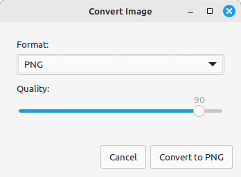

# Convert image

Right click an image to easily convert it to a different format. For Cinnamon / Linux Mint.



## Installation

Install imagemagick:
```sh
sudo apt install imagemagick
```

Copy the files to `~/.local/share/nemo/actions`.

